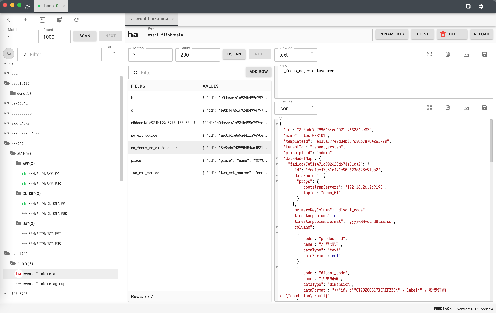

# Redis Fans

A redis desktop client

## Screenshots



## Features

- Multiple session management
- Viewing multiple objects at the same time
- Redis command line like official
- Lua editor

## How to build

```bash
yarn build-all && yarn dist
```
When the command completes, the executable file will be in the dist folder.
